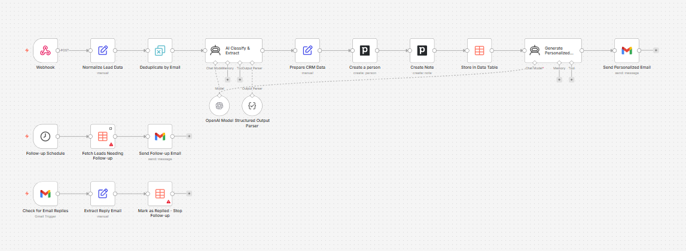

# n8n CRM lead capture — test form

A minimal **lead capture test page** and **local proxy** for sending JSON to an [n8n](https://n8n.io) **Webhook** workflow (for example a CRM or email automation that listens on path `lead-capture`). The browser posts to your machine first; the server forwards the JSON to n8n so you avoid **CORS** issues when calling n8n from a local HTML page.



## What’s included

| Piece | Role |
|--------|------|
| `index.html`, `styles.css`, `app.js` | Contact-style form (name, email, phone, company, message, source) and webhook settings UI |
| `server.mjs` | Serves the static files and implements `POST /api/submit-lead` to forward JSON to your n8n webhook URL |

## Requirements

- **Node.js** 18 or newer

There are no npm package dependencies; only the Node standard library is used.

## Run locally

From this project directory:

```bash
npm start
```

Then open **http://127.0.0.1:3456/** (default). The server listens only on `127.0.0.1`.

### Port

Set a different port with the `PORT` environment variable:

```bash
set PORT=8080
npm start
```

(On Unix shells: `PORT=8080 npm start`.)

## Using the form with n8n

1. In n8n, use a **Webhook** node (POST), not a Form Trigger, for the URL you paste into the form.
2. **Test URL** (`…/webhook-test/lead-capture`): open the workflow, select the Webhook node, click **Listen for test event**, then submit from this app (you may need to start listening again for each test session).
3. **Production URL** (`…/webhook/lead-capture`): activate the workflow, then copy the production webhook URL from the node.

Keep **“Send through this app’s server proxy”** checked and run `npm start` so submissions go to `POST /api/submit-lead` on localhost and the server calls n8n. Uncheck only if n8n allows your browser origin via CORS or you use another same-origin backend.

The webhook URL and proxy checkbox are saved in the browser (`localStorage`).

## JSON payload

Submissions send an object like:

```json
{
  "name": "…",
  "email": "…",
  "phone": "",
  "company": "",
  "message": "",
  "source": "Website Contact Form"
}
```

Email and name are required on the client; a hidden honeypot field reduces trivial bot noise.

## API (local server)

`POST /api/submit-lead`

**Body** (JSON):

```json
{
  "webhookUrl": "https://your-n8n-instance/webhook/lead-capture",
  "payload": { }
}
```

The server POSTs `payload` as JSON to `webhookUrl` and returns a JSON summary including upstream status and a short response preview (for debugging).

## Project scripts

| Script | Command |
|--------|---------|
| Start dev server | `npm start` → `node server.mjs` |

---

This repo is intended for **testing and development** of n8n workflows that accept website-style leads before you wire the same shape of payload from a real site or CRM.
